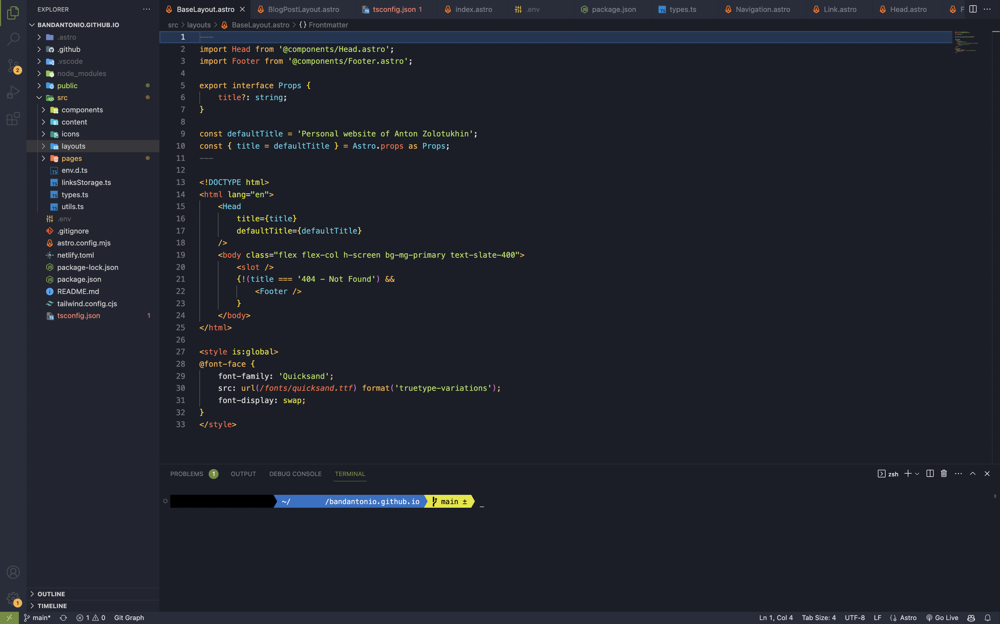

# Aurora Borealis Theme

A dark theme for [Visual Studio Code](https://code.visualstudio.com/).

## Colors

## Showcase

## Installation

1. Press `Ctrl/Cmd+Shift+P`, type **Color Theme** and select **Preferences: Color Theme**
1. In the **dark themes** section, select **Aurora Borealis**